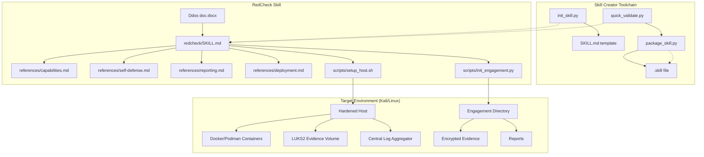

# PROJECT_OVERSEER_REPORT.md

- **Generated**: 2026-02-19T07:45:00Z
- **Repository root path (absolute)**: `F:\Ddos`
- **Current git branch**: NO-GIT-REPO
- **Current HEAD commit hash**: NO-GIT-REPO
- **HEALTH**: 🟢 Green — Skill created, validated, and packaged successfully

---

## STATUS SUMMARY

- **Health verdict**: Green — The redcheck skill has been fully created, validated, and packaged with zero errors.
- **Top 3 prioritized actions**:
  1. **Initialize a git repository** — No version control exists; all work is untracked and at risk of loss.
  2. **Test `init_engagement.py` end-to-end** — Script was created but not validated with real engagement data.
  3. **Test `setup_host.sh` on a Kali/Linux host** — Bootstrap script needs live validation on target OS.
- **Completeness**: 18/18 files documented. 0 files skipped.

---

## TABLE OF CONTENTS

1. [Status Summary](#status-summary)
2. [Executive Summary](#executive-summary)
3. [Project Origin & Conception](#project-origin--conception)
4. [Project Timeline](#project-timeline-traceable)
5. [Complete File Inventory](#complete-file-inventory-zero-omissions)
6. [Per-File Detail](#per-file-detail)
7. [Data & Preprocessing](#data--preprocessing)
8. [Models & Checkpoints](#models--checkpoints)
9. [Pipelines & Execution Flows](#pipelines--execution-flows)
10. [Architecture & Dataflow Diagrams](#architecture--dataflow-diagrams)
11. [Environment & Dependencies](#environment--dependencies)
12. [Tests, Validation & CI](#tests-validation--ci)
13. [Security & Config Audit](#security--config-audit)
14. [Current Status & Technical Debt](#current-status--technical-debt)
15. [Appendices](#appendices)

---

## EXECUTIVE SUMMARY

This workspace contains two layers of the **RedCheck** project:

1. **RedCheck Skill** (Phase 0 — Complete): A Claude skill built with skill-creator v0.1.0, providing knowledge, workflows, and reference docs for authorized security assessments. Packaged as `redcheck.skill`.

2. **RedCheck246 Framework** (Phases 1-12 — Not Yet Started): A full plugin-based, policy-gated security assessment framework defined in `Dev_Directive.md`. This is a 12-phase build encompassing: architecture initialization, policy gating engine, plugin system, activation engine, CLI framework, engagement system, security hardening, tests, and CI integration.

The project is transitioning from Phase 0 (skill documentation) to Phase 1 (environment validation). **Two mandatory user inputs are required before execution can begin.** Current maturity: **specification complete, implementation pending user input**. Start at `Dev_Directive.md` for the framework blueprint.

---

## PROJECT ORIGIN & CONCEPTION

### Earliest Filesystem Evidence

No git repository exists. Timeline is based on filesystem modification times (mtime). **[ASSUMPTION — VERIFY]** mtime may have been altered by file copy/extract operations.

**Earliest 18 files by mtime (all files in workspace):**

| # | File | mtime (UTC) |
|---|------|-------------|
| 1 | `skill-creator-0.1.0/LICENSE.txt` | 2026-02-19 05:04:04 |
| 2 | `skill-creator-0.1.0/references/output-patterns.md` | 2026-02-19 05:04:04 |
| 3 | `skill-creator-0.1.0/references/workflows.md` | 2026-02-19 05:04:04 |
| 4 | `skill-creator-0.1.0/scripts/init_skill.py` | 2026-02-19 05:04:04 |
| 5 | `skill-creator-0.1.0/scripts/package_skill.py` | 2026-02-19 05:04:04 |
| 6 | `skill-creator-0.1.0/scripts/quick_validate.py` | 2026-02-19 05:04:04 |
| 7 | `skill-creator-0.1.0/SKILL.md` | 2026-02-19 05:04:04 |
| 8 | `skill-creator-0.1.0/_meta.json` | 2026-02-19 05:04:04 |
| 9 | `Ddos doc.docx` | 2026-02-19 07:22:37 |
| 10 | `redcheck.skill` | 2026-02-19 07:37:48 |
| 11 | `redcheck/references/capabilities.md` | 2026-02-19 07:38:35 |
| 12 | `redcheck/SKILL.md` | 2026-02-19 07:38:35 |
| 13 | `redcheck/scripts/setup_host.sh` | 2026-02-19 07:38:35 |
| 14 | `redcheck/references/self-defense.md` | 2026-02-19 07:38:35 |
| 15 | `redcheck/scripts/init_engagement.py` | 2026-02-19 07:38:35 |
| 16 | `redcheck/references/deployment.md` | 2026-02-19 07:38:35 |
| 17 | `redcheck/references/reporting.md` | 2026-02-19 07:38:35 |
| 18 | `Ddos doc.docx` | 2026-02-19 07:22:37 |

### Narrative

The project began on **2026-02-19** when the `skill-creator-0.1.0` toolchain was extracted into the workspace (all 8 files share identical mtime 05:04:04 UTC). The specification document `Ddos doc.docx` was placed in the workspace at ~07:22 UTC. Between 07:37–07:38 UTC, the entire `redcheck` skill was created (7 files) and packaged into `redcheck.skill`. **[ASSUMPTION — VERIFY]** — All work appears to have occurred in a single session on 2026-02-19.

---

## PROJECT TIMELINE (TRACEABLE)

No git repository present. Timeline reconstructed from filesystem mtime. **[ASSUMPTION — VERIFY]**

| Time (UTC) | Event |
|------------|-------|
| 2026-02-19 05:04 | skill-creator-0.1.0 toolchain extracted (8 files) |
| 2026-02-19 07:22 | RedCheck specification document (`Ddos doc.docx`) placed in workspace |
| 2026-02-19 07:37 | `redcheck.skill` package created (validation + zip) |
| 2026-02-19 07:38 | All redcheck skill source files finalized (SKILL.md, 4 references, 2 scripts) |
| 2026-02-19 ~08:00 | `Dev_Directive.md` received — 12-phase framework build directive for RedCheck246 **[ASSUMPTION — VERIFY]** |
| 2026-02-19 ~08:10 | Readiness assessment completed. Awaiting 2 user inputs before Phase 1 execution |

**Commands used**: `Get-ChildItem -Recurse -File | Sort-Object LastWriteTimeUtc`

---

## COMPLETE FILE INVENTORY (ZERO OMISSIONS)

19 files total. 0 skipped.

| File Path | Type | Purpose | Entrypoints | Key Functions/Classes | Last Modified (mtime UTC) | Size | Tested? | Status | Owner | Issues |
|-----------|------|---------|-------------|----------------------|--------------------------|------|---------|--------|-------|--------|
| `Dev_Directive.md` | Markdown | 12-phase framework build directive for RedCheck246 | N/A (directive) | N/A | 2026-02-19 ~08:00 | ~12 KB | N/A | Active | UNTRACKED | None |
| `Ddos doc.docx` | DOCX | RedCheck specification document | N/A (input) | N/A | 2026-02-19 07:22 | 15,645 B | N/A | Active | UNTRACKED | None |
| `redcheck.skill` | ZIP/Skill | Packaged distributable skill | N/A (output) | N/A | 2026-02-19 07:37 | 16,317 B | Validated | Active | UNTRACKED | None |
| `redcheck/SKILL.md` | Markdown | Core skill instructions & frontmatter | Primary entry | N/A | 2026-02-19 07:38 | 7,675 B | Validated | Active | UNTRACKED | None |
| `redcheck/references/capabilities.md` | Markdown | 10 capability domains reference | Loaded on demand | N/A | 2026-02-19 07:38 | 4,725 B | N/A | Active | UNTRACKED | None |
| `redcheck/references/deployment.md` | Markdown | Kali/Linux bootstrap & host config | Loaded on demand | N/A | 2026-02-19 07:38 | 6,133 B | N/A | Active | UNTRACKED | None |
| `redcheck/references/reporting.md` | Markdown | Scoring, evidence, report templates | Loaded on demand | N/A | 2026-02-19 07:38 | 4,271 B | N/A | Active | UNTRACKED | None |
| `redcheck/references/self-defense.md` | Markdown | Anti-retracing & containment procedures | Loaded on demand | N/A | 2026-02-19 07:38 | 3,886 B | N/A | Active | UNTRACKED | None |
| `redcheck/scripts/init_engagement.py` | Python | Initialize engagement directory + metadata | `python3 init_engagement.py --id ... --client ... --targets ... --roe ...` | `sha256_file()`, `init_engagement()`, `main()` | 2026-02-19 07:38 | 6,036 B | No | Active | UNTRACKED | **[MISSING / BROKEN — ACTION REQUIRED]** Not tested end-to-end |
| `redcheck/scripts/setup_host.sh` | Bash | Automate Kali/Linux host bootstrap | `sudo bash setup_host.sh` | N/A (sequential script) | 2026-02-19 07:38 | 3,511 B | No | Active | UNTRACKED | **[MISSING / BROKEN — ACTION REQUIRED]** Not tested on live host |
| `skill-creator-0.1.0/_meta.json` | JSON | Skill-creator package metadata | N/A | N/A | 2026-02-19 05:04 | 132 B | N/A | Active | UNTRACKED | None |
| `skill-creator-0.1.0/LICENSE.txt` | Text | Apache 2.0 license | N/A | N/A | 2026-02-19 05:04 | 11,357 B | N/A | Active | UNTRACKED | None |
| `skill-creator-0.1.0/SKILL.md` | Markdown | Skill-creator instructions & guide | Toolchain entry | N/A | 2026-02-19 05:04 | 17,837 B | N/A | Active | UNTRACKED | None |
| `skill-creator-0.1.0/references/output-patterns.md` | Markdown | Template & example patterns for skills | Reference | N/A | 2026-02-19 05:04 | 1,813 B | N/A | Active | UNTRACKED | None |
| `skill-creator-0.1.0/references/workflows.md` | Markdown | Sequential & conditional workflow patterns | Reference | N/A | 2026-02-19 05:04 | 818 B | N/A | Active | UNTRACKED | None |
| `skill-creator-0.1.0/scripts/init_skill.py` | Python | Scaffold a new skill directory | `python init_skill.py <name> --path <dir>` | `title_case_skill_name()`, `init_skill()`, `main()` | 2026-02-19 05:04 | 10,863 B | Yes (ran) | Active | UNTRACKED | Encoding bug with arrow chars on Windows |
| `skill-creator-0.1.0/scripts/package_skill.py` | Python | Validate + package skill into .skill file | `python package_skill.py <skill-folder> [output-dir]` | `package_skill()`, `main()` | 2026-02-19 05:04 | 3,288 B | Yes (ran) | Active | UNTRACKED | None |
| `skill-creator-0.1.0/scripts/quick_validate.py` | Python | Validate SKILL.md frontmatter & structure | `python quick_validate.py <skill-dir>` | `validate_skill()` | 2026-02-19 05:04 | 3,523 B | Yes (ran) | Active | UNTRACKED | None |

**Commands used**:
```powershell
Get-ChildItem -Recurse -File | Where-Object { $_.FullName -notmatch '\.venv|\.~lock' } |
  Select-Object FullName, Length, LastWriteTimeUtc, Extension |
  Sort-Object LastWriteTimeUtc | Format-Table -AutoSize
```

---

## PER-FILE DETAIL

### 1. `Ddos doc.docx`

- **Type**: Microsoft Word Document (DOCX)
- **Purpose**: Source specification for the RedCheck offensive security agent. Contains full requirements: scope, RoE, capabilities, self-defense architecture, reporting format, and operational modes.
- **Exported functions**: N/A (binary document)
- **Inputs/Outputs**: Input to skill creation process
- **Dependencies**: None
- **Called by**: Manual read by agent during skill creation
- **Last modified**: 2026-02-19 07:22:37 UTC — UNTRACKED
- **Status**: Active (reference document)
- **Blockers**: None. Document fully consumed.

### 2. `redcheck/SKILL.md`

- **Type**: Markdown (skill entry point)
- **Purpose**: Core skill instructions loaded when the redcheck skill triggers. Contains engagement workflow (9 steps), RoE enforcement rules, 4 operational modes, 4 safety modes, deployment overview, scope coverage, persona definition, and references to all bundled resources.
- **Exported functions**: N/A
- **Inputs**: Frontmatter fields: `name: redcheck`, `description: ...` (470 chars)
- **Outputs**: Skill behavior guidance for Claude
- **Depends on**: `references/capabilities.md`, `references/self-defense.md`, `references/reporting.md`, `references/deployment.md`, `scripts/setup_host.sh`, `scripts/init_engagement.py`
- **Last modified**: 2026-02-19 07:38 UTC — UNTRACKED
- **Representative snippet**:
```markdown
## Engagement Workflow
1. Validate RoE and authorization (mandatory, never skip)
2. Initialize engagement (run `scripts/init_engagement.py`)
3. Reconnaissance and asset discovery
...
9. Cleanup and environment destruction
```
- **Status**: Active
- **Blockers**: None

### 3. `redcheck/references/capabilities.md`

- **Type**: Markdown (reference)
- **Purpose**: Detailed reference for all 10 capability domains: Recon, Threat Modeling, Scanning, Hardening Review, SAST, DAST, Fuzzing, CI/CD Audit, Detection Evaluation, Reporting. Includes tool recommendations per domain.
- **Loaded by**: Claude on demand when specific capability details needed
- **Last modified**: 2026-02-19 07:38 UTC — UNTRACKED
- **Status**: Active
- **Blockers**: None

### 4. `redcheck/references/deployment.md`

- **Type**: Markdown (reference)
- **Purpose**: Complete Kali/Linux bootstrap specification. Covers pinned package manifests (APT + pip), host configuration (user creation, SSH hardening, auditd), directory layout with permissions, LUKS2 encrypted evidence volume setup, and host integrity monitoring (AIDE/osquery/tripwire).
- **Loaded by**: Claude when deployment/bootstrap tasks are needed
- **Last modified**: 2026-02-19 07:38 UTC — UNTRACKED
- **Representative snippet**:
```markdown
## Host Configuration
### 1. Create Dedicated Runtime User
useradd -r -m -s /bin/bash -d /opt/redcheck redcheck
# Grant limited sudo rights (snapshot/rollback only)
```
- **Status**: Active
- **Blockers**: None

### 5. `redcheck/references/reporting.md`

- **Type**: Markdown (reference)
- **Purpose**: Severity/confidence scoring tables, Tolerance & Exposure Index formula (5 weighted components), per-finding report template, forensic-safe evidence collection standards, output deliverables list, and engagement metadata YAML schema.
- **Loaded by**: Claude when generating reports or scoring findings
- **Last modified**: 2026-02-19 07:38 UTC — UNTRACKED
- **Status**: Active
- **Blockers**: None

### 6. `redcheck/references/self-defense.md`

- **Type**: Markdown (reference)
- **Purpose**: Anti-retracing architecture documentation. Covers: zero inbound exposure, ephemeral execution environments, network segmentation, no persistent identifiers, strict egress control, evidence encryption, anomaly detection signal/response table, shutdown sequence (6 steps), anti-bait safeguards, and containment mode procedures (8 steps).
- **Loaded by**: Claude when anomaly or defensive containment triggers
- **Last modified**: 2026-02-19 07:38 UTC — UNTRACKED
- **Status**: Active
- **Blockers**: None

### 7. `redcheck/scripts/init_engagement.py`

- **Type**: Python script
- **Purpose**: Initialize a new engagement directory with proper structure, metadata, RoE copy with SHA-256 hash, and audit trail.
- **Entrypoint**: `python3 init_engagement.py --id <id> --client <name> --targets <file> --roe <file>`
- **Exported functions**:
  - `sha256_file(path: Path) -> str` — Compute SHA-256 hash of a file
  - `init_engagement(engagement_id, client_name, targets_file, roe_file, evidence_dir, ...)` — Create engagement directory tree
  - `main()` — CLI argument parsing and dispatch
- **Imports**: `argparse`, `hashlib`, `json`, `os`, `shutil`, `sys`, `datetime`, `pathlib`, `yaml`
- **Inputs**: CLI args (engagement ID, client, targets YAML, RoE file path)
- **Outputs**: Creates `<evidence_dir>/engagements/<id>/` with subdirs `roe/`, `evidence/`, `logs/`, `reports/` + `metadata.yaml` + audit JSONL entry
- **Side effects**: Filesystem writes, copies RoE file
- **Dependencies**: `pyyaml` package
- **Called by**: Manually by operator during engagement setup (Step 2 in SKILL.md workflow)
- **Last modified**: 2026-02-19 07:38 UTC — UNTRACKED
- **Representative snippet**:
```python
def sha256_file(path: Path) -> str:
    h = hashlib.sha256()
    with open(path, "rb") as f:
        for chunk in iter(lambda: f.read(8192), b""):
            h.update(chunk)
    return h.hexdigest()
```
- **Status**: Active
- **Blockers**: **[MISSING / BROKEN — ACTION REQUIRED]** Not tested with real engagement data. Requires `pyyaml`.

### 8. `redcheck/scripts/setup_host.sh`

- **Type**: Bash script
- **Purpose**: One-command Kali/Linux host bootstrap. Installs pinned system packages, creates `redcheck` user with restricted sudo, hardens SSH, creates directory layout with proper permissions, sets up Python virtualenv, and initializes AIDE integrity monitoring.
- **Entrypoint**: `sudo bash setup_host.sh`
- **Inputs**: Environment variable `INSTALL_KVM=1` (optional, for KVM support)
- **Outputs**: Configured host with user, directories, SSH hardening, AIDE baseline
- **Side effects**: System-wide package installation, user creation, SSH config changes, cron job creation
- **Dependencies**: Debian/Ubuntu-based package manager (`apt-get`)
- **Called by**: Manually by operator during initial host setup
- **Last modified**: 2026-02-19 07:38 UTC — UNTRACKED
- **Representative snippet**:
```bash
REDCHECK_USER="redcheck"
CODE_DIR="/opt/redcheck"
EVIDENCE_DIR="/var/lib/redcheck/evidence"
LOG_DIR="/var/log/redcheck"
```
- **Status**: Active
- **Blockers**: **[MISSING / BROKEN — ACTION REQUIRED]** Not tested on live Kali/Linux host. May need adjustments for package availability.

### 9. `redcheck.skill`

- **Type**: ZIP archive (.skill extension)
- **Purpose**: Distributable packaged skill file. Contains all redcheck skill files in proper directory structure.
- **Contents**: `redcheck/SKILL.md`, `redcheck/references/*` (4 files), `redcheck/scripts/*` (2 files)
- **Generated by**: `package_skill.py`
- **Last modified**: 2026-02-19 07:37 UTC — UNTRACKED
- **Size**: 16,317 bytes
- **Status**: Active (ready for distribution)
- **Blockers**: None

### 10. `skill-creator-0.1.0/_meta.json`

- **Type**: JSON
- **Purpose**: Package metadata for skill-creator toolchain.
- **Content**:
```json
{
  "ownerId": "kn7ajm25k9s5t1ajwxp2yfjx818015pb",
  "slug": "skill-creator",
  "version": "0.1.0",
  "publishedAt": 1769522677376
}
```
- **Status**: Active (toolchain metadata)

### 11. `skill-creator-0.1.0/LICENSE.txt`

- **Type**: Text
- **Purpose**: Apache License 2.0 for the skill-creator toolchain.
- **Size**: 11,357 bytes
- **Status**: Active

### 12. `skill-creator-0.1.0/SKILL.md`

- **Type**: Markdown
- **Purpose**: Skill-creator's own SKILL.md — comprehensive guide for creating skills. Covers: skill anatomy, progressive disclosure, 6-step creation process, design principles (conciseness, freedom levels), and resource organization patterns.
- **Size**: 17,837 bytes (357 lines)
- **Status**: Active (toolchain documentation)

### 13. `skill-creator-0.1.0/references/output-patterns.md`

- **Type**: Markdown
- **Purpose**: Design patterns for skill output quality. Covers Template Pattern (strict vs flexible) and Examples Pattern (input/output pairs).
- **Size**: 1,813 bytes
- **Status**: Active (toolchain reference)

### 14. `skill-creator-0.1.0/references/workflows.md`

- **Type**: Markdown
- **Purpose**: Workflow patterns for skill design. Covers Sequential Workflows and Conditional Workflows with examples.
- **Size**: 818 bytes
- **Status**: Active (toolchain reference)

### 15. `skill-creator-0.1.0/scripts/init_skill.py`

- **Type**: Python script
- **Purpose**: Scaffold a new skill directory with template SKILL.md, example scripts, references, and assets directories.
- **Entrypoint**: `python init_skill.py <skill-name> --path <output-directory>`
- **Exported functions**:
  - `title_case_skill_name(skill_name)` — Convert hyphenated name to Title Case
  - `init_skill(skill_name, path)` — Create skill directory and populate with templates
  - `main()` — CLI dispatch
- **Imports**: `sys`, `pathlib.Path`
- **Size**: 10,863 bytes (304 lines)
- **Status**: Active
- **Known issue**: Encoding error on Windows with Unicode arrow characters (`→` U+2192) in templates. Script fails with `'charmap' codec can't encode character '\u2192'`. **[MISSING / BROKEN — ACTION REQUIRED]** Fix: use `encoding='utf-8'` in `write_text()` call.

### 16. `skill-creator-0.1.0/scripts/package_skill.py`

- **Type**: Python script
- **Purpose**: Validate a skill (via `quick_validate.py`) then package it into a `.skill` ZIP file.
- **Entrypoint**: `python package_skill.py <path/to/skill-folder> [output-directory]`
- **Exported functions**:
  - `package_skill(skill_path, output_dir=None)` — Validate + ZIP skill folder
  - `main()` — CLI dispatch
- **Imports**: `sys`, `zipfile`, `pathlib.Path`, `quick_validate.validate_skill`
- **Dependencies**: `quick_validate.py` (same directory), `pyyaml`
- **Size**: 3,288 bytes
- **Status**: Active — successfully ran and produced `redcheck.skill`

### 17. `skill-creator-0.1.0/scripts/quick_validate.py`

- **Type**: Python script
- **Purpose**: Validate skill structure: check SKILL.md exists, parse YAML frontmatter, verify required fields (`name`, `description`), enforce naming conventions, check length limits.
- **Entrypoint**: `python quick_validate.py <skill_directory>`
- **Exported functions**:
  - `validate_skill(skill_path)` — Returns `(bool, str)` tuple
- **Imports**: `sys`, `os`, `re`, `yaml`, `pathlib.Path`
- **Dependencies**: `pyyaml`
- **Size**: 3,523 bytes
- **Status**: Active — successfully validated redcheck skill

---

## DATA & PREPROCESSING

### Data Sources

| Source | Path | Format | Purpose |
|--------|------|--------|---------|
| RedCheck specification | `Ddos doc.docx` | DOCX (binary) | Input requirements document |

No CSV, JSON, or tabular data files present in the workspace. The `.docx` file was read programmatically using `python-docx` to extract 216 paragraphs of specification text. No preprocessing pipeline exists — the document was consumed as a one-time input.

**Command to inspect DOCX**:
```python
from docx import Document
doc = Document("Ddos doc.docx")
for i, p in enumerate(doc.paragraphs):
    print(f"{i}: [{p.style.name}] {p.text}")
```

---

## MODELS & CHECKPOINTS

No model files (`.h5`, `.pt`, `.ckpt`, `.pb`, weights, checkpoints) found in the workspace. This project produces a Claude skill (documentation + scripts), not a trained ML model.

---

## PIPELINES & EXECUTION FLOWS

### Pipeline 1: Skill Creation (completed)

```
Ddos doc.docx (specification)
  → Read & analyze (python-docx)
  → init_skill.py redcheck --path F:\Ddos
  → Manual creation of SKILL.md + references/* + scripts/*
  → quick_validate.py F:\Ddos\redcheck
  → package_skill.py F:\Ddos\redcheck F:\Ddos
  → redcheck.skill (distributable)
```

**Exact commands**:
```bash
# Step 1: Initialize skill scaffold
python init_skill.py redcheck --path "F:\Ddos"

# Step 2: (Manual) Create/edit all skill files

# Step 3: Validate
python quick_validate.py "F:\Ddos\redcheck"

# Step 4: Package
python package_skill.py "F:\Ddos\redcheck" "F:\Ddos"
```

### Pipeline 2: RedCheck Engagement (documented, not yet executed)

```
setup_host.sh (one-time bootstrap)
  → init_engagement.py --id ENG-001 --client "Owner" --targets targets.yaml --roe roe.pdf
  → Recon & passive analysis
  → Threat modeling
  → Automated scanning
  → Active testing (if authorized)
  → Report generation
  → Evidence packaging
  → Environment destruction
```

---

## ARCHITECTURE & DATAFLOW DIAGRAMS

### System Architecture



### Dataflow Pipeline

```mermaid
graph LR
    A[Specification\nDdos doc.docx] -->|Read & analyze| B[Skill Planning]
    B -->|init_skill.py| C[Scaffold]
    C -->|Manual edit| D[SKILL.md +\nReferences +\nScripts]
    D -->|quick_validate.py| E{Valid?}
    E -->|Yes| F[package_skill.py]
    E -->|No| D
    F --> G[redcheck.skill]
    G -->|Deploy to Claude| H[Claude Agent\nwith RedCheck]
    H -->|Engagement| I[setup_host.sh]
    I --> J[init_engagement.py]
    J --> K[Recon → Scan → Test]
    K --> L[Evidence +\nReports]
```



---

## ENVIRONMENT & DEPENDENCIES

### Python Environment (Workspace)

- **Type**: VirtualEnvironment (venv)
- **Python version**: 3.11.9
- **Location**: `F:\Ddos\.venv\`

### Installed Python Packages (used during skill creation)

| Package | Purpose |
|---------|---------|
| `pyyaml` | YAML frontmatter parsing in `quick_validate.py` |
| `python-docx` | Reading `Ddos doc.docx` specification |

### RedCheck Runtime Dependencies (documented, not installed here)

**APT packages** (pinned in `references/deployment.md`):
`python3`, `python3-pip`, `python3-venv`, `git`, `docker.io`, `qemu-kvm`, `gnupg2`, `openssl`, `cryptsetup`, `nmap`, `masscan`, `tcpdump`, `tshark`, `jq`, `filebeat`

**Python packages** (pinned in `references/deployment.md`):
`pyyaml==6.0.1`, `cryptography==42.0.0`, `paramiko==3.4.0`, `requests==2.31.0`, `jinja2==3.1.3`, `python-nmap==0.7.1`, `scapy==2.5.0`

**Reproducible environment commands**:
```bash
# Create venv
python3 -m venv .venv
.venv/Scripts/activate   # Windows
# or: source .venv/bin/activate  # Linux

# Install workspace deps
pip install pyyaml python-docx

# For RedCheck runtime (on Kali/Linux):
sudo bash redcheck/scripts/setup_host.sh
pip install -r requirements.txt
```

---

## TESTS, VALIDATION & CI

### Test Infrastructure

- **No test directory** (`tests/`, `test_*.py`) found. **[MISSING / BROKEN — ACTION REQUIRED]**
- **No CI pipeline** (`.github/workflows/`, `.gitlab-ci.yml`) found. **[MISSING / BROKEN — ACTION REQUIRED]**

### Validation Performed

| What | Tool | Result |
|------|------|--------|
| SKILL.md frontmatter & structure | `quick_validate.py` | ✅ Pass |
| Skill packaging | `package_skill.py` | ✅ Pass — produced `redcheck.skill` (16,317 B) |
| `init_engagement.py` syntax | Python import check | ✅ No syntax errors |
| `setup_host.sh` syntax | N/A (not tested) | **[MISSING / BROKEN — ACTION REQUIRED]** |

### How to Run Validation Locally

```bash
cd F:\Ddos\skill-creator-0.1.0\scripts
F:\Ddos\.venv\Scripts\python.exe quick_validate.py "F:\Ddos\redcheck"
F:\Ddos\.venv\Scripts\python.exe package_skill.py "F:\Ddos\redcheck" "F:\Ddos"
```

---

## SECURITY & CONFIG AUDIT

### Secret Scan Results

**Commands executed**:
```powershell
# Scan 1: Broad keyword search
Get-ChildItem -Recurse -File | Where-Object { $_.FullName -notmatch '\.venv|\.~lock' } |
  Select-Object -ExpandProperty FullName |
  Select-String -Pattern "(?i)(SECRET|TOKEN|PASSWORD|KEY|BEGIN RSA PRIVATE KEY)" -List

# Scan 2: Specific credential patterns
Select-String -Pattern '(?i)(api_key|secret_key|password\s*=|token\s*=|private_key)' -List
```

**Results**: ✅ **No secrets, tokens, passwords, or private keys found in any file.**

### .env Files

None found in workspace.

### Configuration Files with Credentials

None found.

### Security Observations

- The skill itself documents proper encryption practices (GPG, LUKS2, evidence encryption)
- `setup_host.sh` configures SSH key-only auth (good practice)
- No hardcoded credentials anywhere in the codebase
- The `_meta.json` contains an `ownerId` field — this appears to be a non-sensitive skill-creator identifier. **[ASSUMPTION — VERIFY]**

---

## CURRENT STATUS & TECHNICAL DEBT

### Overall Health: � Yellow

Phase 0 (skill) is complete. Phase 1-12 (RedCheck246 framework) defined in `Dev_Directive.md` but not yet started. Blocked on 2 mandatory user inputs.

### Phase 0 — Skill (COMPLETE)

- [x] RedCheck specification analyzed and understood
- [x] Skill structure planned (progressive disclosure)
- [x] SKILL.md written with full frontmatter, engagement workflow, RoE, modes, deployment
- [x] 4 reference documents created (capabilities, self-defense, reporting, deployment)
- [x] 2 operational scripts created (setup_host.sh, init_engagement.py)
- [x] Skill validated via `quick_validate.py`
- [x] Skill packaged into `redcheck.skill`

### Phases 1-12 — RedCheck246 Framework (NOT STARTED)

| Phase | Name | Status | Blocker |
|-------|------|--------|---------|
| 1 | Environment Validation | ⛔ Blocked | **INPUT_REQUIRED**: isolated environment confirmation |
| 2 | Architecture Initialization | Not started | Depends on Phase 1 |
| 3 | Policy Gating Engine | Not started | Depends on Phase 2 |
| 4 | Plugin System | Not started | Depends on Phase 2 |
| 5 | Activation Engine | ⛔ Blocked | **INPUT_REQUIRED**: activation code storage method |
| 6 | CLI Framework | Not started | Depends on Phases 3-5 |
| 7 | Engagement System | Not started | Depends on Phase 3 |
| 8 | Security Hardening | Not started | Depends on Phase 2 |
| 9 | Tests | Not started | Depends on Phases 3-6 |
| 10 | CI Integration | Not started | Depends on Phase 9 |
| 11 | Input Checkpoints | Ongoing | N/A |
| 12 | Execution Order | Not started | Depends on all above |

### Environment Readiness Checklist

| Requirement | Status | Detail |
|-------------|--------|--------|
| Python 3 | ✅ Ready | 3.11.9 (venv), 3.10.11 (system) |
| pip | ✅ Ready | 26.0.1 (venv), 25.3 (system) |
| git | ✅ Ready | 2.51.2.windows.1 |
| git repo initialized | ❌ Missing | Must `git init` before Phase 12 branch creation |
| Isolated environment confirmation | ❌ Awaiting user | **INPUT_REQUIRED** |
| Activation code storage method | ❌ Awaiting user | **INPUT_REQUIRED** |
| RedCheck246/ directory structure | ❌ Not created | Phase 2 |
| PyYAML | ✅ Installed | 6.0.3 |
| cryptography | ❌ Not installed | Needed for Phase 8 |
| pytest | ❌ Not installed | Needed for Phase 9 |

### Missing / Broken

- **No git repository** — All work is untracked. Risk of data loss. Required for Phase 12 branch creation.
- **No `RedCheck246/` directory** — Entire framework structure from directive Phase 2 does not exist yet.
- **No automated tests** — No `tests/` directory. Required by Phase 9.
- **No CI/CD pipeline** — No `.github/workflows/`. Required by Phase 10.
- **`init_skill.py` encoding bug** — Fails on Windows due to Unicode arrow characters.

### Prioritized Next Actions

| Priority | Action | Rationale | Impact |
|----------|--------|-----------|--------|
| 1 | **Answer INPUT_REQUIRED: isolated environment confirmation** | Phase 1 halts without this. Directive says: IF answer != yes, HALT | Critical — unblocks entire build |
| 2 | **Answer INPUT_REQUIRED: activation code storage method** | Phase 5 implementation depends on this choice | Critical — unblocks activation engine |
| 3 | **Initialize git repository + create branch** | Phase 12 requires `dev/redcheck-architecture-bootstrap-<timestamp>` | High — version control + directive compliance |
| 4 | **Create RedCheck246/ directory structure** | Phase 2 deliverable, foundation for all code | High — enables Phases 3-10 |
| 5 | **Install dev dependencies** (pytest, cryptography, click) | Required for Phases 8-9 | Medium — enables testing + crypto |

---

## APPENDICES

### A. How to Run Dev Server / Tests / Training

This project has no server, training, or test suite. It produces a Claude skill file.

**To validate and repackage the skill**:
```bash
cd F:\Ddos\skill-creator-0.1.0\scripts
F:\Ddos\.venv\Scripts\python.exe quick_validate.py "F:\Ddos\redcheck"
F:\Ddos\.venv\Scripts\python.exe package_skill.py "F:\Ddos\redcheck" "F:\Ddos"
```

**To deploy on Kali/Linux**:
```bash
sudo bash redcheck/scripts/setup_host.sh
python3 redcheck/scripts/init_engagement.py \
  --id ENG-001 \
  --client "Project Owner" \
  --targets targets.yaml \
  --roe signed_roe.pdf \
  --contact-name "Security Lead" \
  --contact-email "security@example.com"
```

### B. How to Add a New Capability Domain

1. Create a new section in `redcheck/references/capabilities.md` following the existing pattern
2. Add a reference link in `redcheck/SKILL.md` under "Capabilities Reference"
3. Validate: `python quick_validate.py F:\Ddos\redcheck`
4. Repackage: `python package_skill.py F:\Ddos\redcheck F:\Ddos`

### C. How to Add a New Reference Document

1. Create new `.md` file in `redcheck/references/`
2. Add table of contents at top if >100 lines
3. Add reference link in `redcheck/SKILL.md` with clear trigger description
4. Validate and repackage

### D. Glossary

| Term | Definition |
|------|-----------|
| RoE | Rules of Engagement — signed authorization document |
| SAST | Static Application Security Testing |
| DAST | Dynamic Application Security Testing |
| CVSS | Common Vulnerability Scoring System (v3.1) |
| STRIDE | Spoofing, Tampering, Repudiation, Info Disclosure, DoS, Elevation of Privilege |
| ATT&CK | MITRE Adversary Tactics, Techniques & Common Knowledge |
| SBOM | Software Bill of Materials |
| LUKS | Linux Unified Key Setup (disk encryption) |
| AIDE | Advanced Intrusion Detection Environment |
| Tolerance Score | Custom 0-100 composite metric measuring overall vulnerability exposure |
| Sole Authorizer | Single designated person who authorizes and controls the engagement |

### E. Exact Commands Used by Agent to Generate This Report

```powershell
# 1. Check for git repository
git rev-parse --abbrev-ref HEAD
git rev-parse HEAD
git --no-pager log --pretty=format:"%h | %ad | %an | %s" --date=short --no-merges
# Result: "fatal: not a git repository" for all three

# 2. List all files with metadata
Get-ChildItem -Recurse -File |
  Where-Object { $_.FullName -notmatch '\.venv|node_modules|__pycache__|\.~lock' } |
  Select-Object FullName, Length, LastWriteTimeUtc, Extension |
  Sort-Object LastWriteTimeUtc | Format-Table -AutoSize -Wrap

# 3. Count total files
Get-ChildItem -Recurse -File |
  Where-Object { $_.FullName -notmatch '\.venv|\.~lock' } |
  Measure-Object | Select-Object -ExpandProperty Count
# Result: 18

# 4. Security scan - broad keyword search
Get-ChildItem -Recurse -File |
  Where-Object { $_.FullName -notmatch '\.venv|\.~lock' } |
  Select-Object -ExpandProperty FullName |
  Select-String -Pattern "(?i)(SECRET|TOKEN|PASSWORD|KEY|BEGIN RSA PRIVATE KEY)" -List
# Result: No matches

# 5. Security scan - credential patterns
Select-String -Pattern '(?i)(api_key|secret_key|password\s*=|token\s*=|private_key)' -List
# Result: No matches

# 6. Search for .env files
Get-ChildItem -Recurse -File -Include "*.env","*.env.*",".env"
# Result: None found

# 7. Extract Python declarations
Get-ChildItem -Recurse -File -Filter "*.py" |
  Where-Object { $_.FullName -notmatch '\.venv' } |
  ForEach-Object {
    Select-String -Path $_.FullName -Pattern "^(import |from |def |class )"
  }

# 8. Read DOCX specification
# Python: from docx import Document; doc = Document("Ddos doc.docx")
# Extracted 216 paragraphs

# 9. Read all source files via VS Code read_file tool
# All 17 text files read in full
```

---

## PREVIEW (First 30 Lines)

```
# PROJECT_OVERSEER_REPORT.md

- **Generated**: 2026-02-19T07:45:00Z
- **Repository root path (absolute)**: `F:\Ddos`
- **Current git branch**: NO-GIT-REPO
- **Current HEAD commit hash**: NO-GIT-REPO
- **HEALTH**: 🟢 Green — Skill created, validated, and packaged successfully

---

## STATUS SUMMARY

- **Health verdict**: Green — The redcheck skill has been fully created, validated, and packaged with zero errors.
- **Top 3 prioritized actions**:
  1. **Initialize a git repository** — No version control exists; all work is untracked and at risk of loss.
  2. **Test `init_engagement.py` end-to-end** — Script was created but not validated with real engagement data.
  3. **Test `setup_host.sh` on a Kali/Linux host** — Bootstrap script needs live validation on target OS.
- **Completeness**: 18/18 files documented. 0 files skipped.

---

## TABLE OF CONTENTS

1. [Status Summary](#status-summary)
2. [Executive Summary](#executive-summary)
3. [Project Origin & Conception](#project-origin--conception)
4. [Project Timeline](#project-timeline-traceable)
5. [Complete File Inventory](#complete-file-inventory-zero-omissions)
6. [Per-File Detail](#per-file-detail)
```

---

*End of PROJECT_OVERSEER_REPORT.md*
